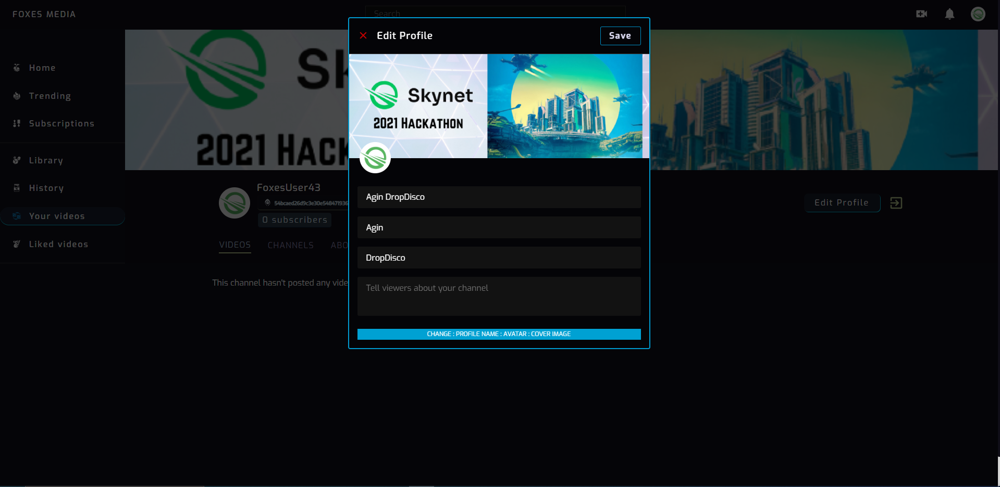
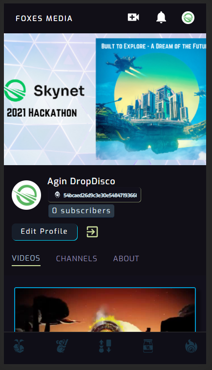

# FOXES MEDIA 

[](https://app.netlify.com/sites/festive-hopper-a48689/deploys)


FOXES MEDIA using  (Postgres, Skynet-Js, SkynetLabs). 


### Check out the deployed site

# SiaSkynet [DEMO](https://000fdf2l0t2qgn0nihdauhpuiv8e4jsfoshssvdinq72ud3ifj8nnk0.siasky.net)

# Netlify [DEMO](https://foxes-media.netlify.app)


## Recomended Video View 


## Trending Video View 


## Edit Profile View 




## Upload Video and Watch The Preview while Upload Progress 


## Mobile UI View
<p align="center">

</p>


## Mobile UI Watch View
<p align="center">

</p>


## Core packages

1. Redux - State Management
2. React Router - Routing
3. Provider - Skynet-js && SkynetLabs

## Video uploads
>> The requirement for this Hackathon (Build phase) only two part. ( Content Record DAC and MySKy ). 
>>> So for uploading Video & Image / Thumbnail we use cloudinary hosting. 


## Features

1. Connect using MySky
2. Upload video
3. Search video by channel name, userID, username
4. Search video by title, description
5. Like/Dislike video
6. Subscribe/Unsubscribe from channels
7. Add comment
8. Edit profile (avatar, cover)
9. Liked videos
10. History


## Running locally

At the root of your project create an .env file with the following contents:

```bash
# BE stands for Backend Endpoint
REACT_APP_FOXES_SKY= <Your Backend Endpoint>
```

Then run <code>npm i</code> and <code>npm start</code> 

For more detailed instructions, [click here](#)

### NOTED: if you got an issue/ error you can clear the local storage or cookies
>> todo open developer tools on browser, then Application , Right click and clear inside a Local storage tab. >> Refresh.  
